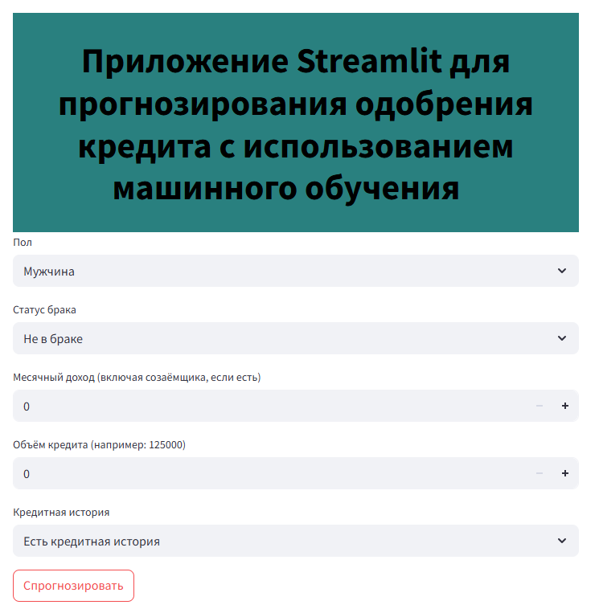
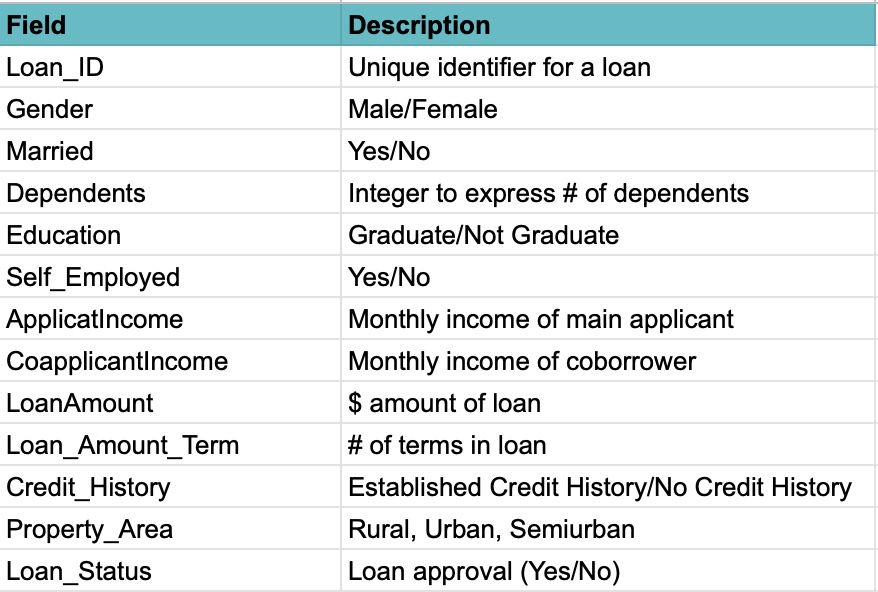

## Прогнозирование одобрения кредита — модель Random Forest и веб-приложение

## Цель проекта:
Продемонстрировать полный проект по машинному обучению — от начала до развёртывания в виде веб-приложения.

## Бизнес-задача:
Создать модель, которая точно прогнозирует одобрение кредитов и автоматизирует ручной процесс принятия решений.

## Цель:
Точно предсказывать одобрение кредитов, избегая при этом слишком большого числа ошибочных одобрений (минимизировать ложноположительные решения — False Positives).

## Результат:
Веб-приложение, которое конечные пользователи могут использовать для прогнозирования одобрения кредитов, с моделью Random Forest на серверной части.
    
  

### В репозитории:

1. Данные

2. Создание модели Random Forest (Loan Approval Model.ipynb)

3. Пример дерева решений из случайного леса
    
 

4. Код веб-приложения (streamlit_app.py)

5. Скриншот веб-приложения

6. Обученную модель - Loan_Approval_Prediction.pkl

## Результаты и оценка модели: 

С бизнес-точки зрения мы хотим избегать ситуаций, когда модель предсказывает положительное решение по кредиту, хотя на самом деле он был отклонён (ложноположительные результаты — False Positives). Поэтому наилучшей метрикой для оценки модели будет точность (Precision). Это гарантирует, что наши прогнозы одобрения кредитов действительно соответствуют реальным одобрениям.

Поскольку данная модель демонстрирует очень близкие значения точности как на обучающих, так и на тестовых данных, она, по-видимому, наилучшим образом сбалансирована: обеспечивает высокую предсказательную способность на обучающем наборе без переобучения и без потери качества прогнозов на тестовых данных.

**Precision:** 
Точность (precision) на тестовых данных составляет около 78%, что означает, что у нас не так много ложноположительных результатов. Это отлично, поскольку с точки зрения бизнеса мы хотим избегать прогнозов одобрения кредитов, которые впоследствии придётся отклонять.

**Accuracy:**
На тестовых данных Accuracy составляет около 80%, что означает, что модель правильно предсказывает 4 из 5 кредитов.

**Полнота (Recall):**
Полнота (Recall) на тестовых данных составляет 100%, что означает, что модель точно предсказывает все истинно положительные случаи. Это значит, что мы не упустим ни одного потенциального одобрения кредита (и, соответственно, связанного с ним дохода).

**F1 Score:**
F1-оценка на тестовых данных составляет около 88%, что отлично, поскольку она учитывает как ложноположительные, так и ложноотрицательные результаты.

## Влияние на бизнес: 

Конечные пользователи смогут использовать веб-приложение, построенное на основе этой модели, чтобы прогнозировать одобрение кредитов прямо на глазах у заёмщика. Не будет упущенных возможностей для получения дохода, поскольку модель выявляет все истинные одобрения (полнота равна 100%), и лишь небольшая часть заёмщиков, которым прогнозируется одобрение, на самом деле будет отклонена. Это ускорит ручной процесс согласования и позволит компании обрабатывать больше кредитов за меньшее время, что приведёт к увеличению числа клиентов и росту доходов.

### Следующие шаги: отслеживать производительность модели и переобучать её на новых данных по мере их поступления.
